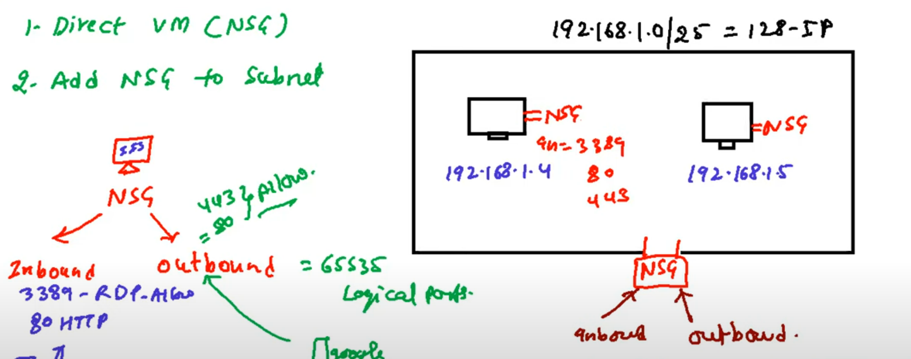

# Configure-Network-Security-Group-NSG-

## What is Network Security Group (NSG)??

A **Network Security Group (NSG)** in Azure is like a firewall that controls the flow of traffic to and from resources like virtual machines (VMs) and subnets. It works using a set of rules that allow or deny traffic based on factors like IP addresses, ports, and protocols (TCP/UDP). You can apply an NSG to a subnet to filter traffic for multiple VMs or directly to a VM for more specific control. This helps protect your resources by blocking unwanted access while allowing only necessary connections, improving security in your Azure environment.

### Summary: Configuring NSG in Azure  

In this project, I first created a **virtual network (VNet) with a subnet** to be assigned to the virtual machines. Then, I deployed **two virtual machines (VMs)** within this network. After that, I configured **two Network Security Groups (NSGs)**—one for the VMs and another for the subnet.  

For the **VM NSG**, I allowed only **HTTP and HTTPS traffic** so that the **IIS website is accessible only within the VMs** and not from the outside. For the **Subnet NSG**, I restricted access and only allowed **RDP traffic**, enabling remote management of the VMs. This setup ensures controlled and secure network communication within the Azure environment.

## Step - 1

i. Creating a Virtual Network 

