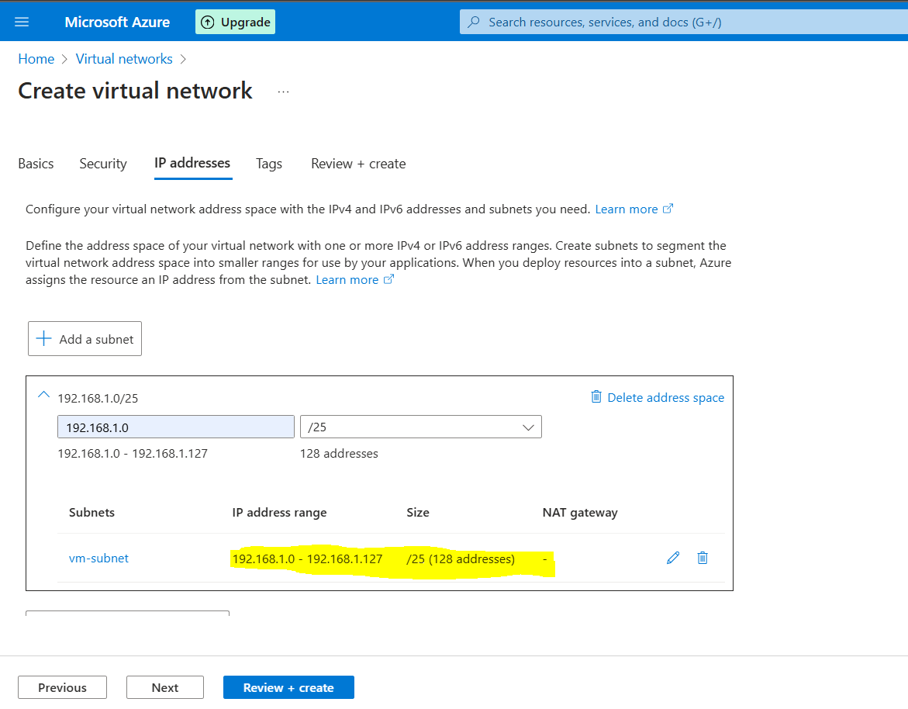

# Configure-Network-Security-Group-NSG-

## What is Network Security Group (NSG)??

A **Network Security Group (NSG)** in Azure is like a firewall that controls the flow of traffic to and from resources like virtual machines (VMs) and subnets. It works using a set of rules that allow or deny traffic based on factors like IP addresses, ports, and protocols (TCP/UDP). You can apply an NSG to a subnet to filter traffic for multiple VMs or directly to a VM for more specific control. This helps protect your resources by blocking unwanted access while allowing only necessary connections, improving security in your Azure environment.

### Summary: Configuring NSG in Azure  

In this project, I first created a **virtual network (VNet) with a subnet** to be assigned to the virtual machines. Then, I deployed **two virtual machines (VMs)** within this network. After that, I configured **two Network Security Groups (NSGs)**—one for the VMs and another for the subnet.  

For the **VM NSG**, I allowed only **HTTP and HTTPS traffic** so that the **IIS website is accessible only within the VMs** and not from the outside. For the **Subnet NSG**, I restricted access and only allowed **RDP traffic**, enabling remote management of the VMs. This setup ensures controlled and secure network communication within the Azure environment.

## Step - 1

i. Creating a Virtual Network (**I have created a virtual network named Demo-vnet.**)

ii. Navigate to **IP Addressing** and create a **subnet** (**configured with a Class C IP range**).

## Step - 2

i. Create **two virtual machines (VMs)** (**ensure that the RDP port is selected during setup**).

## Step - 3

i. Create **two Network Security Groups (NSGs)**—one for the **VMs** and another for the **subnet**.

## Step - 4

i. Open the **VM NSG** and configure inbound rules to allow **HTTP (Port 80), HTTPS (Port 443), and RDP (Port 3389)** access.

ii. Open the **Subnet NSG** and configure an inbound rule to allow **RDP (Port 3389) access only**.

## Step - 5

i. Open the **Web-1** virtual machine, navigate to **Network Settings**, and select the **Network Interface** to access the **NSG** options.

ii. Click on **Network Security Group (NSG)**, select **VM-NSG** (the NSG created for the VMs), and click **Save**. Repeat the same process for the **second VM**.

iii. Now, set the **NSG** for the subnet. Open the **virtual network** you created, select **Subnets**, click on the specific **subnet**, and then choose the **Subnet-NSG** that you created for the subnet.

## Step - 6

i. Connect both **virtual machines** and install the **IIS server** on each to host the website.

ii. Once the website is hosted, obtain the **public IP address** of the VM and paste it into your browser (not within the virtual machine).

You will notice that we are unable to access the website hosted on the VM. This is because, based on the **Network Security Group (NSG)** rules, **HTTP and HTTPS** traffic is only allowed within the VMs and not from external sources.

iii. Now, paste the same **public IP address** into the browser on your **Web-2 VM**.

You will notice that you are able to access the website from within the same subnet, as the **VM NSG** allows **HTTP and HTTPS traffic** only within the VMs, and the communication between the VMs within the same subnet is permitted.

